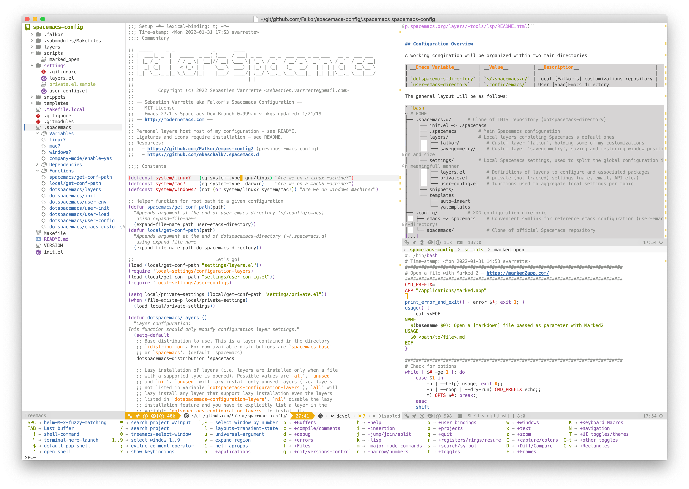

       _____     _ _              _       ____
      |  ___|_ _| | | _____  _ __( )___  / ___| _ __   __ _  ___ ___ _ __ ___   __ _  ___ ___
      | |_ / _` | | |/ / _ \| '__|// __| \___ \| '_ \ / _` |/ __/ _ \ '_ ` _ \ / _` |/ __/ __|
      |  _| (_| | |   < (_) | |    \__ \  ___) | |_) | (_| | (_|  __/ | | | | | (_| | (__\__ \
      |_|  \__,_|_|_|\_\___/|_|    |___/ |____/| .__/ \__,_|\___\___|_| |_| |_|\__,_|\___|___/
                                               |_|
                 ____             __ _                       _   _
                / ___|___  _ __  / _(_) __ _ _   _ _ __ __ _| |_(_) ___  _ __
               | |   / _ \| '_ \| |_| |/ _` | | | | '__/ _` | __| |/ _ \| '_ \
               | |__| (_) | | | |  _| | (_| | |_| | | | (_| | |_| | (_) | | | |
                \____\___/|_| |_|_| |_|\__, |\__,_|_|  \__,_|\__|_|\___/|_| |_|
                                       |___/
                 Copyright (c) 2022 S. Varrette <sebastien.varrette@gmail.com>


<a href="https://www.spacemacs.org/">
  
</a>

__Personal settings and customization for [Spacemacs](https://www.spacemacs.org/)__, the Emacs distribution I'm now using.

> The best editor is neither Emacs nor Vim, it's Emacs and Vim!
> [Spacemacs](https://www.spacemacs.org/) is a new way of experiencing Emacs -- it's a sophisticated and polished set-up, focused on ergonomics, mnemonics and consistency.

It superseeds my [previous emacs settings](https://github.com/Falkor/emacs-config2) made for Emacs 24 which is now obsoblete.

 [](https://github.com/Falkor/spacemacs-config/blob/devel/LICENSE) [](https://github.com/Falkor/spacemacs-config) [](https://github.com/Falkor/spacemacs-config/issues) [](https://github.com/Falkor/spacemacs-config/releases)  

<p align="center">
<b><a href="#installation">Installation</a></b>
|
<b><a href="#configuration-overview">Configuration Overview</a></b>
|
<b><a href="#usage">Usage</a></b>
|
<b><a href="#screenshots">Screenshots</a></b>
</p>


## Installation

The below installation notes are made for a **setup on Mac OS**.
You will have to adapt them for the other environments. See also [Spacemacs Practicalli](https://practical.li/spacemacs/) for general information.

1. (_if not done yet_) __Install Emacs__ (See [emacs-plus](https://github.com/d12frosted/homebrew-emacs-plus) for more information.) with [Homebrew](https://brew.sh/)
    - `emacs-plus` used to demonstrate some [flickering issues](https://github.com/syl20bnr/spacemacs/issues/12009) that may be annoying, consider `emacs-mac` port in that case.
    - You may want to run directly `make install-emacs-{plus|mac}` from this repository depending on the chosen option to run the below commands

```bash
# Option 1 (emacs-plus) - 'make install-emacs-plus'
brew tap d12frosted/emacs-plus
brew install emacs-plus --with-spacemacs-icon
brew linkapps emacs-plus
# Option 2 (emacs-mac) - 'make install-emacs-mac'
brew tap railwaycat/emacsmacport
brew install --cask emacs-mac-spacemacs-icon
```

2. You **MUST** clone the __current__ repository into `~/.spacemacs.d`

```bash
git clone https://github.com/Falkor/spacemacs-config.git ~/.spacemacs.d
# Alternative setup (my preferred way to keep things organised):
#     clone into ~/git/github.com/Falkor/spacemacs-config and symlink where appropriate
mkdir -p ~/git/github.com/Falkor/
cd ~/git/github.com/Falkor/
git clone https://github.com/Falkor/spacemacs-config.git
ln -s ~/git/github.com/Falkor/spacemacs-config ~/.spacemacs.d
```

3. __Install Spacemacs__ into your [XDG emacs directory](https://wiki.archlinux.org/title/XDG_Base_Directory) _i.e_ `~/.config/spacemacs` and ensure ``~/.config/emacs` points to that directory.
    - use symbolic links for `~/.config/emacs` to quickly switch between spacemacs and any other setup (Ex: [Doom Emacs](https://github.com/hlissner/doom-emacs), [My previous `Falkor/emacs-config2`](https://github.com/Falkor/emacs-config2) ... )
    - we'll use the [develop](https://develop.spacemacs.org/) branch of spacemacs
    - alternatively, you can clone it into the default emacs configuration directory `~/.emacs.d`
    - You may want to run directly: `make install-spacemacs`

```bash
cd ~/.spacemacs.d
make install-spacemacs
### In details, default XDG-compliant installation
mkdir .config
git clone https://github.com/syl20bnr/spacemacs ~/.config/spacemacs
ln -s ~/.config/spacemacs  ~/.config/emacs   # emacs config expected in ~/.config/emacs
cd ~/.config/spacemacs
git checkout develop
```

4. __Install some nice fonts__ (required for the [Spacelines-all-the-icons](https://github.com/domtronn/spaceline-all-the-icons.el) mode-line)
    - You may want to run directly: `make install-fonts-darwin`

```bash
brew tap homebrew/cask-fonts
brew install --cask font-source-code-pro font-meslo-lg-nerd-font
```

5. You will also need to **disable** a keybord shortcut set by default on Mac OS for the CTRL-SPC sequence.
    - Go into **System Preferences / Keybord / Shortcuts / Input Source** and uncheck the settings.

6. Finally, you will have to install a few system packages required for the different [layers](settings/layers.el) to work properly. Just run:

```bash
make bootstrap
```

This will install the following packages:

| Spacemacs Layer                                                        | Required dependency                                           | Installation (_if different_) |
|------------------------------------------------------------------------|---------------------------------------------------------------|-------------------------------|
| [Ma]git                                                                | [Delta](https://dandavison.github.io/delta/installation.html) | `brew install git-delta`      |
| python                                                                 | black, flake8, ipython,                                       |                               |
| [ruby](https://develop.spacemacs.org/layers/+lang/ruby/README.html)    | prettier, solargraph                                          |                               |
| C-C++                                                                  | rtags                                                         |                               |
| [CMake](https://develop.spacemacs.org/layers/+tools/cmake/README.html) | cmake                                                         |                               |
| shell                                                                  | shellcheck                                                    |                               |
| solidity                                                               | solc                                                          | `brew install solidity`       |
| dash                                                                   | Dash, sqlite3                                                 | `brew install dash5 sqlite3`  |

In addition, a few NPM dependencies will be installed to satisfy the [LSP layer](https://develop.spacemacs.org/layers/+tools/lsp/README.html)``


## Configuration Overview

A working congiration will be organized within two main directories

| __Emacs Variable__       | __Value__         | __Description__                            |
|--------------------------|-------------------|--------------------------------------------|
| `dotspacemacs-directory` | `~/.spacemacs.d/` | Local [Falkor's] customizations repository |
| `user-emacs-directory`   | `.config/emacs/`  | User [Spac]Emacs directory                 |

The general layout will be as follows:

```bash
~ # HOME
├── .spacemacs.d/      # Clone of THIS repository (dotspacemacs-directory)
│    ├── init.el -> .spacemacs
│    ├── .spacemacs        # Main Spacemacs configuration
│    ├── layers/           # Local layers completing Spacemacs's default ones
│    │   ├── falkor/          # Custom layer 'falkor', holding some of my customizations
│    │   └── savegeometry/    # Custom layer 'savegeometry', saving and restoring window position and size
│    ├── settings/         # Local Spacemacs settings, used to split the global configuration in meaningfull manner
│    │   ├── layers.el        # Definitions of layers to configure and associated packages
│    │   ├── private.el       # private (not tracked) settings (name, email, API etc.)
│    │   └── user-config.el   # functions used to aggregate local settings per topic
│    ├── snippets/
│    └── templates
│        ├── auto-insert
│        └── yatemplates
├── .config/           # XDG configuration diretorie
│   ├── emacs -> spacemacs    # Convenient symlink for reference emacs configuration (user-emacs-directory)
│   └── spacemacs/            # Clone of official Spacemacs repository
[...]
```

In details:

* The main Spacemacs configuration file (dotfile) [`.spacemacs`](.spacemacs) holds the [global configuration](https://www.spacemacs.org/doc/QUICK_START.html) -- see also [dotfile content](https://www.spacemacs.org/doc/DOCUMENTATION.html#dotfile-contents)
    - the configuration layers (`dotspacemacs-configuration-layers`) are defined in [`settings/layers.el`](settings/layers.el)
    - The current list of themes is defined in [`.spacemacs`](.spacemacs) under the `dotspacemacs-themes` variable
    - the configuration for user code (part of the function `dotspacemacs/user-config` in [`.spacemacs`](.spacemacs)) relies when possible on code defined as functions `local-settings/<topic>-config` under [`settings/user-config.el`](settings/user-config.el)

This repository hosts also local [spacemacs layers](http://spacemacs.org/doc/LAYERS.html) (see also [explaination on layers](http://www.modernemacs.com/post/migrate-layers/)):

* [`savegeometry`](layers/savegeometry/): save and restore window position and sie between Emacs launches
* [`falkor`](layers/falkor/): my own customizations, to be placed at the **last** position.

For several reasons, it was _not_ possible to outsource all customization into the [`falkor`](layers/falkor/) which explains why a lot of settings are still set into  [`.spacemacs`](.spacemacs).

## Usage

See [spacemacs cheatsheet](https://devhints.io/spacemacs) for a review of the _default_ settings.

In addition, I have imported from my [historical emacs configuration](https://github.com/Falkor/emacs-config2/tree/devel/config) my favorite key bindings made compliant with the [`hybrid`](https://www.spacemacs.org/doc/DOCUMENTATION.html#hybrid) editing style.
The below tables review the most noticable changes you may want to be aware before using my configuration.

|                | Normal state | Insert State |
|----------------|--------------|--------------|
| __Leader key__ | SPC          | CTRL+SPC     |
| __META+X__     | SPC SPC      | CTRL+SPC SPC |

From that stage, you have access to all Spacemacs key bindings.
Indeed, a help buffer ([`which-key`](https://github.com/justbur/emacs-which-key)) is displayed each time the SPC key is pressed in normal mode. It lists the available key bindings and their associated commands.

[Custom key bindings](https://develop.spacemacs.org/doc/DOCUMENTATION.html) for the common modes will be documented here.


## Screenshots



### Theme and Modeline

This configuration relies on the `doom-tomorrow-day` theme (part of the [Doom theme megapack for GNU Emacs](https://github.com/doomemacs/themes#theme-list)).

The modeline is based on [Spacelines-all-the-icons](https://github.com/domtronn/spaceline-all-the-icons.el)

Example of a modified buffer in insert state (press '`i`' as in Vim):


Idem but un normal state (`ESC`)


[▲ back to top](#readme)
