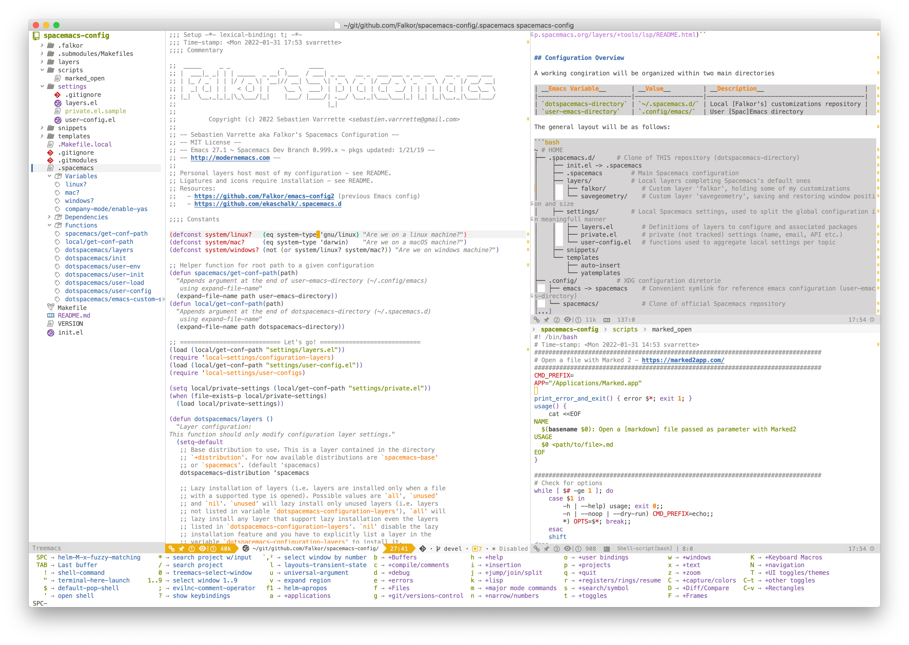

 [](https://github.com/Falkor/spacemacs-config) [](https://github.com/Falkor/spacemacs-config/issues)

       _____     _ _              _       ____
      |  ___|_ _| | | _____  _ __( )___  / ___| _ __   __ _  ___ ___ _ __ ___   __ _  ___ ___
      | |_ / _` | | |/ / _ \| '__|// __| \___ \| '_ \ / _` |/ __/ _ \ '_ ` _ \ / _` |/ __/ __|
      |  _| (_| | |   < (_) | |    \__ \  ___) | |_) | (_| | (_|  __/ | | | | | (_| | (__\__ \
      |_|  \__,_|_|_|\_\___/|_|    |___/ |____/| .__/ \__,_|\___\___|_| |_| |_|\__,_|\___|___/
                                               |_|
                 ____             __ _                       _   _
                / ___|___  _ __  / _(_) __ _ _   _ _ __ __ _| |_(_) ___  _ __
               | |   / _ \| '_ \| |_| |/ _` | | | | '__/ _` | __| |/ _ \| '_ \
               | |__| (_) | | | |  _| | (_| | |_| | | | (_| | |_| | (_) | | | |
                \____\___/|_| |_|_| |_|\__, |\__,_|_|  \__,_|\__|_|\___/|_| |_|
                                       |___/
                 Copyright (c) 2022-2025 S. Varrette <sebastien.varrette@gmail.com>


<a href="https://www.spacemacs.org/">
  
</a>

__Personal settings and customization for [Spacemacs](https://www.spacemacs.org/)__, the Emacs distribution I'm now using.

> The best editor is neither Emacs nor Vim, it's Emacs and Vim!
> [Spacemacs](https://www.spacemacs.org/) is a new way of experiencing Emacs -- it's a sophisticated and polished set-up, focused on ergonomics, mnemonics and consistency.

It superseeds my [previous emacs settings](https://github.com/Falkor/emacs-config2) made for Emacs 24 which is now obsoblete. [spacemacs cheatsheet](https://jeffreyfreeman.me/files/spacemacs-ultimate-cheatsheet.pdf)

 [](https://github.com/Falkor/spacemacs-config/blob/devel/LICENSE) [](https://github.com/Falkor/spacemacs-config) [](https://github.com/Falkor/spacemacs-config/issues) [](https://github.com/Falkor/spacemacs-config/tags)  

<p align="center">
<b><a href="#installation">Installation</a></b>
|
<b><a href="#configuration-overview">Configuration Overview</a></b>
|
<b><a href="#usage">Usage</a></b>
|
<b><a href="#screenshots">Screenshots</a></b>
</p>

This repository is inspired from the excellent work performed by [Spacemacs Practicalli](https://practical.li/spacemacs/).

> [Emacs](https://www.gnu.org/software/emacs/) has been a shining beacon of Free and Open Source software from the early 1970's and has grown to be a versatile set of development tools for all languages. This long history has given [Emacs](https://www.gnu.org/software/emacs/) the ability to interact with almost every aspect of your digital life.
>
> [Spacemacs](http://spacemacs.org/) is a community configuration providing a consistent and simple to learn approach to using all the features and power of [Emacs](https://www.gnu.org/software/emacs/). [Spacemacs](https://spacemacs.org/) also integrates the raw text manipulation speed of Vim and multi-modal editing into the Emacs experience, enabling you to be even more productive.

## Installation

```bash
# TL;DR;
make setup
# Mac OS specific: select emacs backend
make install-emacs-darwin-mac-plus # Default on 'make install-emacs'
make install-emacs-darwin-macport  # alternative
```

The `make setup` will actually perform the following actions:

```bash
make setup-xdg        # setup XDG directories ~/.config etc.
make install-packages # install complementary system packages
make install-fonts    # install some nerd fonts
make install-emacs    # actually done on linux with 'make install-packages' - multiple options (mac-plus (default),macport) on Mac OS
make install-spacemacs         # install (or update) latest version of spacemacs under ~/.config/emacs
make install-spacemacs-config  # install the present spacemacs configuration under     ~/.config/spacemacs
```

### Pre-requisites

#### Emacs

Spacemacs is a configuration for Emacs, so naturally Emacs should be installed before Spacemacs can be used.
Emacs is available for Linux, MacOSX and Windows. The [Spacemacs Readme suggested ways to install Emacs](https://github.com/syl20bnr/spacemacs/tree/develop#emacs) - see also [the practical.li guide](https://practical.li/spacemacs/install-spacemacs/pre-install/#install-emacs). On Mac OS, you have [several options](https://github.com/syl20bnr/spacemacs#macos).

```bash
### Linux: Debian/RHEL -like
sudo { apt | dnf | ...}  install emacs

### Mac OS - using Homebrew
# Option 1: Emacs plus https://github.com/d12frosted/homebrew-emacs-plus
brew tap d12frosted/emacs-plus
brew install emacs-plus@29 --with-spacemacs-icon
# Option 2: emacs-mac
brew tap railwaycat/emacsmacport
brew install --cask emacs-mac-spacemacs-icon
```

Alternative using the root `Makefile`:

```bash
make install-emacs
```


#### Complementary command line tools

In addition, several command line tools are expected. See [practical instructions](https://practical.li/spacemacs/install-spacemacs/pre-install/#helm-locate).
You can install them on your system with  (see [`.Makefile.local`](.Makefile.local) for the current list through the `*_PACKAGE_LIST` variables):

```bash
make install-packages
```

Here is an example of some system dependencies to satisfy:

| __Spacemacs Layer__                                                    | __Required dependency__                                       |                                                         |
|------------------------------------------------------------------------+---------------------------------------------------------------+---------------------------------------------------------|
| [Ma]git                                                                | [Delta](https://dandavison.github.io/delta/installation.html) | `brew install git-delta`. Install deb package on Debian |
| python                                                                 | black, flake8, ipython,                                       |                                                         |
| [ruby](https://develop.spacemacs.org/layers/+lang/ruby/README.html)    | prettier, solargraph                                          |                                                         |
| [C-C++](https://www.spacemacs.org/layers/+lang/c-c++/README.html)      | rtags, cscope, ccls                                           |                                                         |
| [CMake](https://develop.spacemacs.org/layers/+tools/cmake/README.html) | cmake                                                         |                                                         |
| shell                                                                  | shellcheck                                                    |                                                         |
| solidity                                                               | solc                                                          | `brew install solidity`                                 |
| dash                                                                   | Dash, sqlite3                                                 | `brew install dash5 sqlite3`                            |

In addition, a few NPM dependencies may be installed to satisfy the [LSP layer](https://spacemacs.org/layers/+tools/lsp/README.html)``


### Clone Spacemacs

__Install Spacemacs__ into your [XDG emacs directory](https://wiki.archlinux.org/title/XDG_Base_Directory) `~/.config/emacs`

```bash
make install-spacemacs         # install (or update) latest version of spacemacs under ~/.config/emacs
# Or, manually:
git clone https://github.com/syl20bnr/spacemacs ~/.config/emacs.spacemacs.d
cd ~/.config
ln -s emacs.spacemacs.d ~/.config/emacs
```

_Note_:  using symbolic links for `~/.config/emacs` allows you to quickly switch between spacemacs  and any other emacs setup (Ex: [Doom Emacs](https://github.com/hlissner/doom-emacs), [My previous `Falkor/emacs-config2`](https://github.com/Falkor/emacs-config2) ... )

Ensure you use the [develop](https://develop.spacemacs.org/) branch of spacemacs.

### Clone my personnal Spacemacs configuration

```bash
make install-spacemacs-config  # install the present spacemacs configuration under     ~/.config/spacemacs
# Or, manually:
git clone https://github.com/Falkor/spacemacs-config.git ~/.config/spacemacs.falkor.d
cd ~/.config
ln -s spacemacs.falkor.d ~/.config/spacemacs
```

### Configure your shell profile accordingly

Set the `SPACEMACSDIR` environment variable to the `~/.config/spacemacs` directory so that Spacemacs will find this location.
For that, add the following context to yout favorite shell configuration:

```bash
export XDG_CONFIG_HOME=$HOME/.config
export XDG_DATA_HOME=$HOME/.local/share
export XDG_STATE_HOME=$HOME/.local/state
export XDG_CACHE_HOME=$HOME/.cache

# Set XDG location of Emacs Spacemacs configuration
if [ -d "${XDG_CONFIG_HOME}/spacemacs" ]; then
   # Set XDG location of Emacs Spacemacs configuration
   export SPACEMACSDIR="$XDG_CONFIG_HOME/spacemacs"
fi
```

### Install complementary fonts

Several nice fonts are required for the [Spacelines-all-the-icons](https://github.com/domtronn/spaceline-all-the-icons.el) mode-line.
Note that you would need them for setting up a [nice Git prompt for your shell](https://svarrette-anssi.gitlab.io/tutorial-git/TP/config/#configuring-a-git-prompt-in-your-shell).

```bash
make install-fonts
```

See also `dotspacemacs-default-font` in [`init.el`](.spacemacs) to see the selected font


### Disable system keyboard shortcut CTRL-SPC

You will also need to **disable** if needed a keyboard shortcut set by default on Mac OS or Linux / Gnome / Plasma for the CTRL-SPC sequence.

Go into **System Preferences / Keybord / Shortcuts / Input Source** and uncheck the settings.

### Run emacs for the first time

Now it's time to run `emacs`: Spacemacs will then automatically downloads required Emacs packages, creating a compiled `.elc** file for each Emacs lisp file etc.

If Emacs supports native compilation, then the compilation process can take longer, although Emacs should run many tasks faster or more efficiently.

### Icon Fonts

The proposed spacemacs configuration relies on the modern looking doom modeline theme, which requires fonts icons.

**Once Spacemacs is running, issue the following commands to install a wide range of fonts**.

- `SPC SPC all-the-icons-install-fonts`
- `SPC SPC spaceline-all-the-icons`

### Spacemacs ready for action

Spacemacs is now up and running. You probably wish to check [Spacemacs Basics section](/spacemacs/spacemacs-basics/) to learn how to use Vim style editing and work with files, buffers and windows in Spacemacs.

## Configuration Overview

A working congiration will be organized within two main directories

| __Emacs Variable__       | __Value__              | __Description__                            |
|--------------------------|------------------------|--------------------------------------------|
| `dotspacemacs-directory` | `~/.config/spacemacs/` | Local [Falkor's] customizations repository |
| `user-emacs-directory`   | `~/.config/emacs/`     | User [Spac]Emacs directory                 |

The general layout will be as follows:

```bash
~ # HOME
├── .spacemacs.d/      # Clone of THIS repository (dotspacemacs-directory)
│    ├── init.el -> .spacemacs
│    ├── .spacemacs        # Main Spacemacs configuration
│    ├── layers/           # Local layers completing Spacemacs's default ones
│    │   ├── falkor/          # Custom layer 'falkor', holding some of my customizations
│    │   └── savegeometry/    # Custom layer 'savegeometry', saving and restoring window position and size
│    ├── settings/         # Local Spacemacs settings, used to split the global configuration in meaningfull manner
│    │   ├── layers.el        # Definitions of layers to configure and associated packages
│    │   ├── private.el       # private (not tracked) settings (name, email, API etc.)
│    │   └── user-config.el   # functions used to aggregate local settings per topic
│    ├── snippets/
│    └── templates
│        ├── auto-insert
│        └── yatemplates
├── .config/           # XDG configuration diretorie
│   ├── emacs -> spacemacs    # Convenient symlink for reference emacs configuration (user-emacs-directory)
│   └── spacemacs/            # Clone of official Spacemacs repository
[...]
```

In details:

* The main Spacemacs configuration file (dotfile) [`.spacemacs`](.spacemacs) holds the [global configuration](https://www.spacemacs.org/doc/QUICK_START.html) -- see also [dotfile content](https://www.spacemacs.org/doc/DOCUMENTATION.html#dotfile-contents)
    - the configuration layers (`dotspacemacs-configuration-layers`) are defined in [`settings/layers.el`](settings/layers.el)
    - The current list of themes is defined in [`.spacemacs`](.spacemacs) under the `dotspacemacs-themes` variable
    - the configuration for user code (part of the function `dotspacemacs/user-config` in [`.spacemacs`](.spacemacs)) relies when possible on code defined as functions `local-settings/<topic>-config` under [`settings/user-config.el`](settings/user-config.el)

This repository hosts also local [spacemacs layers](http://spacemacs.org/doc/LAYERS.html) (see also [explaination on layers](http://www.modernemacs.com/post/migrate-layers/)):

* [`savegeometry`](layers/savegeometry/): save and restore window position and sie between Emacs launches
* [`falkor`](layers/falkor/): my own customizations, to be placed at the **last** position.

For several reasons, it was _not_ possible to outsource all customization into the [`falkor`](layers/falkor/) which explains why a lot of settings are still set into  [`.spacemacs`](.spacemacs).

## Usage

See [spacemacs cheatsheet](https://devhints.io/spacemacs) for a review of the _default_ settings.

In addition, I have imported from my [historical emacs configuration](https://github.com/Falkor/emacs-config2/tree/devel/config) my favorite key bindings made compliant with the [`hybrid`](https://www.spacemacs.org/doc/DOCUMENTATION.html#hybrid) editing style.
The below tables review the most noticable changes you may want to be aware before using my configuration.

|                | Normal state | Insert State |
|----------------|--------------|--------------|
| __Leader key__ | SPC          | CTRL+SPC     |
| __META+X__     | SPC SPC      | CTRL+SPC SPC |

From that stage, you have access to all Spacemacs key bindings.
Indeed, a help buffer ([`which-key`](https://github.com/justbur/emacs-which-key)) is displayed each time the SPC key is pressed in normal mode. It lists the available key bindings and their associated commands.

[Custom key bindings](https://develop.spacemacs.org/doc/DOCUMENTATION.html) for the common modes will be documented here.

#### Magit

To interact with github or gitlab forges, you will have to store the tokens - see [official instructions](https://magit.vc/manual/ghub.html#Getting-Started) or [practicallu forge configs](https://github.com/practicalli/spacemacs/blob/main/source-control/forge-configuration.md)

```bash
git config --global github.user USERNAME
git config --global gitlab.user USERNAME
```

To [create a token](https://magit.vc/manual/forge.html#Token-Creation), use the web interface of the forge/host you want to connect to.
Here is a list of pages to do this for certain popular hosts:

* [GitHub personal access tokens](https://github.com/settings/tokens) - 3 scopes are required:
    - `repo`: grants full read/write access to private and public repositories.
    - `user`: grants access to profile information.
    - `read:org`: grants read-only access to organization membership.
* [GitLab personal access tokens](https://gitlab.com/-/profile/personal_access_tokens)
    - `api` is the only required scope.

Once you have your token, you will have to store it in GPG encrypted form under `~/.spacemacs.d/.authinfo.gpg`

* Create a file `~/.spacemacs.d/.authinfo` with the following content (adapt USERNAME and TOKEN accordingly) -- no comment!

```
machine api.github.com login USERNAME^forge password YOURTOKEN
```

* Use `SPC SPC epa-encrypt-file` to encrypt the file with gpg
    - kill the buffer and check that Emacs is able to open and read the file
    - if yes: delete the file `~/.spacemacs.d/.authinfo`

You can check your correct settings by restarting Emacs, enter magit status (SPC g s) and press '@' to enter forge mode, 'a' to add the current repository.

## Screenshots



### Theme and Modeline

This configuration relies on the `doom-tomorrow-day` theme (part of the [Doom theme megapack for GNU Emacs](https://github.com/doomemacs/themes#theme-list)).

The modeline is based on [Spacelines-all-the-icons](https://github.com/domtronn/spaceline-all-the-icons.el)

Example of a modified buffer in insert state (press '`i`' as in Vim):


Idem but un normal state (`ESC`)


[▲ back to top](#readme)
